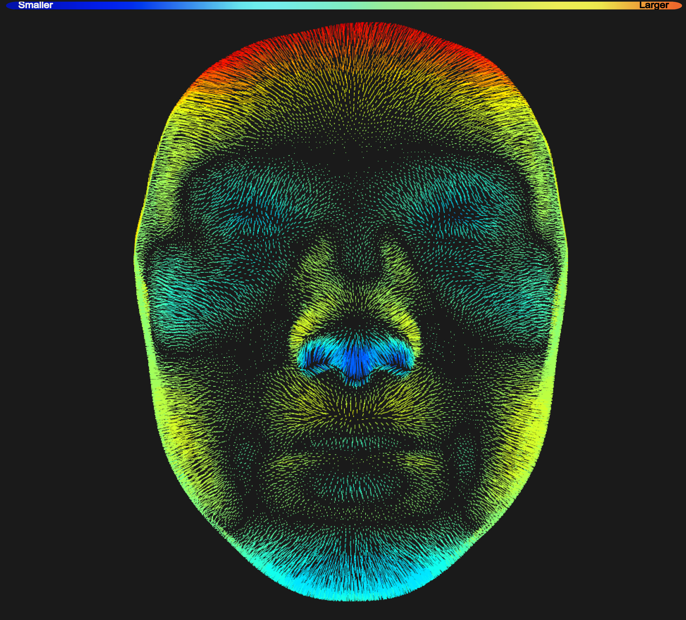

<h1 align='center'> Hey</h1>

I'm David. 

I'm currently a PhD candidate in medical science in the <a href="https://cumming.ucalgary.ca/lab/morpho/homeHallgrimssonLab">Hallgrimsson lab</a> at the University of Calgary.
 

I'm most interested how genetic variation produces both syndromic and non-sydromic facial shapes. I spend lots of time making visualizations of  faces.

<i>Above: <a href="https://en.wikipedia.org/wiki/Costello_syndrome">Costello syndrome</a> compared to a typical non-syndromic face.</i>

I'm an advocate for writing tools for <a href="https://genopheno.ucalgary.ca">sharing your data</a>.

